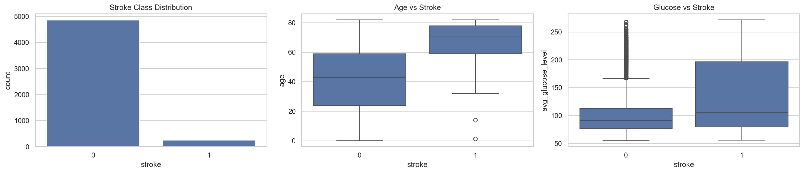
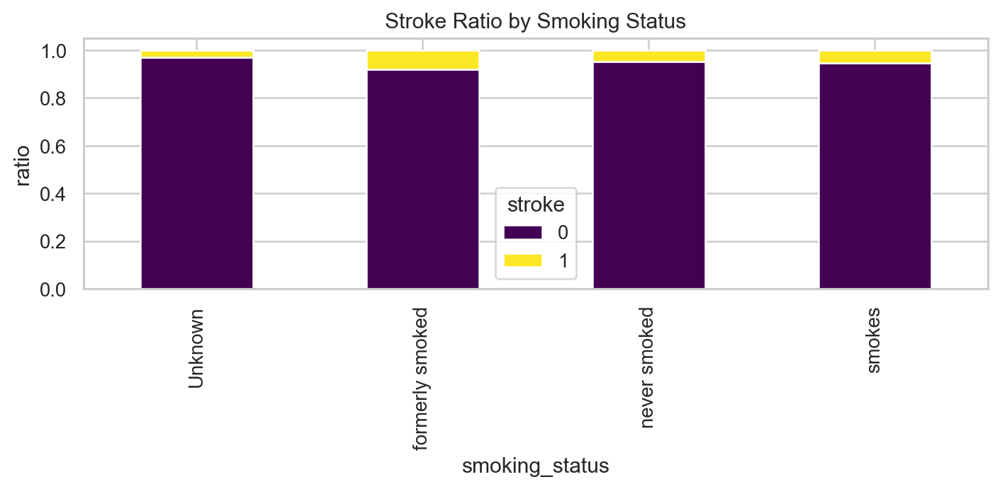
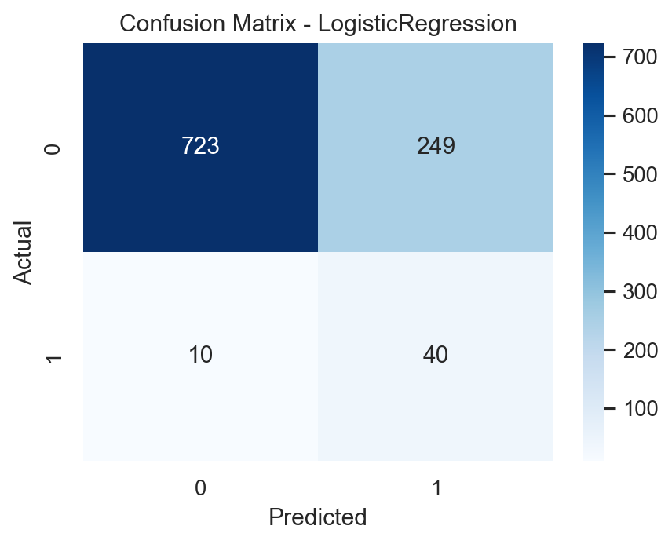
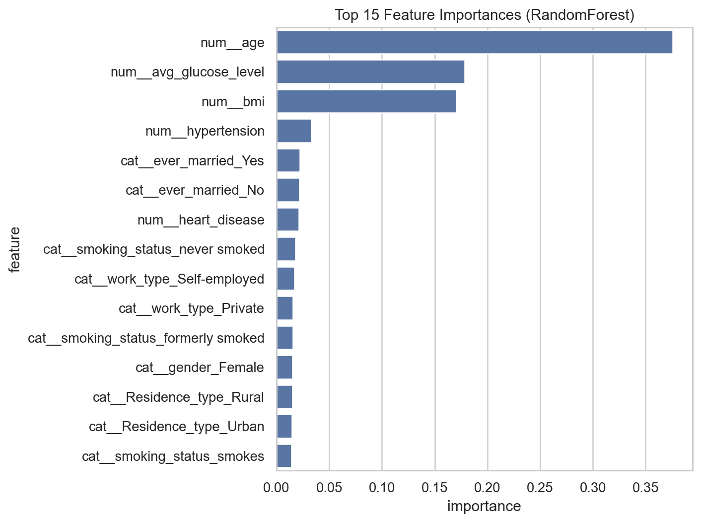

# Stroke Prediction Dataset 資料探勘詳細過程報告

## 一、專題目的

本專題使用 `healthcare-dataset-stroke-data.csv` 醫療資料集進行中風預測。資料內容包含病患基本資料、疾病狀態、生活型態與是否曾中風。本次分析依照資料探勘流程進行，包含資料載入、資料檢查、缺失值處理、探索性資料分析、模型建立、模型比較、最佳模型評估與特徵重要度分析。

本資料集的目標欄位為 `stroke`，其中 `stroke=1` 代表曾發生中風，`stroke=0` 代表未中風。由於中風屬於高風險醫療事件，模型若漏判中風個案會造成較大風險，因此本報告特別重視 `Recall`，也就是模型找出真正中風個案的能力。

> 註：本報告中的輸出結果與圖片是依照 `main.ipynb` 的流程重新執行產生。Random Forest 使用 `n_jobs=1`，避免本機環境因平行運算權限造成執行失敗；此設定只影響運算方式，不改變模型邏輯與資料處理流程。

## 二、資料載入與基本檢查

### 2.1 使用套件

```python
# 0) 套件
import os
from urllib.request import urlretrieve

import numpy as np
import pandas as pd
import seaborn as sns
import matplotlib.pyplot as plt

from sklearn.model_selection import train_test_split
from sklearn.compose import ColumnTransformer
from sklearn.pipeline import Pipeline
from sklearn.preprocessing import OneHotEncoder
from sklearn.impute import SimpleImputer
from sklearn.linear_model import LogisticRegression
from sklearn.ensemble import RandomForestClassifier
from sklearn.metrics import (
    classification_report,
    confusion_matrix,
    accuracy_score,
    precision_score,
    recall_score,
    f1_score,
    roc_auc_score
)

pd.set_option('display.max_columns', None)
sns.set_theme(style='whitegrid')
```

本段程式匯入資料分析、視覺化、資料前處理、模型建立與模型評估所需的套件。主要使用 `pandas` 進行資料處理，`seaborn` 與 `matplotlib` 繪製圖表，並使用 `scikit-learn` 建立機器學習流程。報告整理時另外加入 `accuracy_score` 與 `precision_score`，用來完整呈現模型比較結果。

### 2.2 讀取資料

```python
DATA_PATH = 'healthcare-dataset-stroke-data.csv'
MIRROR_URLS = [
    'https://raw.githubusercontent.com/datasciencedojo/datasets/master/healthcare-dataset-stroke-data.csv',
    'https://raw.githubusercontent.com/akmand/datasets/main/healthcare-dataset-stroke-data.csv'
]

if not os.path.exists(DATA_PATH):
    downloaded = False
    for url in MIRROR_URLS:
        try:
            print(f'嘗試下載: {url}')
            urlretrieve(url, DATA_PATH)
            downloaded = True
            print(f'下載完成: {DATA_PATH}')
            break
        except Exception as e:
            print(f'下載失敗: {e}')

    if not downloaded:
        raise FileNotFoundError('找不到本機資料，且自動下載失敗，請手動放入 CSV。')

df = pd.read_csv(DATA_PATH)
print(f'資料筆數與欄位數: {df.shape}')
display(df.head())
df.info()
```

### 2.3 輸出結果

```text
資料筆數與欄位數: (5110, 12)
```

前 5 筆資料如下：

| id | gender | age | hypertension | heart_disease | ever_married | work_type | Residence_type | avg_glucose_level | bmi | smoking_status | stroke |
| ---: | --- | ---: | ---: | ---: | --- | --- | --- | ---: | ---: | --- | ---: |
| 9046 | Male | 67.0 | 0 | 1 | Yes | Private | Urban | 228.69 | 36.6 | formerly smoked | 1 |
| 51676 | Female | 61.0 | 0 | 0 | Yes | Self-employed | Rural | 202.21 | NaN | never smoked | 1 |
| 31112 | Male | 80.0 | 0 | 1 | Yes | Private | Rural | 105.92 | 32.5 | never smoked | 1 |
| 60182 | Female | 49.0 | 0 | 0 | Yes | Private | Urban | 171.23 | 34.4 | smokes | 1 |
| 1665 | Female | 79.0 | 1 | 0 | Yes | Self-employed | Rural | 174.12 | 24.0 | never smoked | 1 |

資料欄位與型態摘要：

```text
columns:
['id', 'gender', 'age', 'hypertension', 'heart_disease', 'ever_married',
 'work_type', 'Residence_type', 'avg_glucose_level', 'bmi',
 'smoking_status', 'stroke']

dtypes:
id                     int64
gender                str
age                  float64
hypertension           int64
heart_disease          int64
ever_married          str
work_type             str
Residence_type        str
avg_glucose_level    float64
bmi                  float64
smoking_status        str
stroke                 int64
```

資料共有 5110 筆、12 個欄位。欄位中同時包含數值型資料與類別型資料，因此後續前處理需要分別處理。

## 三、缺失值與目標變數分布

### 3.1 程式碼

```python
missing = pd.DataFrame({
    'missing_count': df.isnull().sum(),
    'missing_ratio_%': (df.isnull().mean() * 100).round(2)
}).sort_values('missing_count', ascending=False)
display(missing[missing['missing_count'] > 0])

print('stroke 分布（筆數）:')
print(df['stroke'].value_counts().sort_index())
print('\nstroke 分布（%）:')
print((df['stroke'].value_counts(normalize=True).sort_index() * 100).round(2))
```

### 3.2 輸出結果

缺失值統計如下：

| 欄位 | missing_count | missing_ratio_% |
| --- | ---: | ---: |
| bmi | 201 | 3.93 |

目標變數 `stroke` 分布如下：

| stroke | 筆數 | 比例 |
| ---: | ---: | ---: |
| 0 | 4861 | 95.13% |
| 1 | 249 | 4.87% |

### 3.3 結果說明

資料中只有 `bmi` 欄位存在缺失值，共 201 筆，缺失比例為 3.93%。目標變數方面，未中風樣本佔 95.13%，中風樣本只佔 4.87%，表示本資料集存在嚴重類別不平衡問題。

若只使用 Accuracy 作為評估指標，模型可能只要大量預測為未中風就能得到很高準確率，但這樣無法真正找出中風高風險個案。因此後續模型評估會特別重視 Recall、F1-score 與 ROC-AUC。

## 四、資料前處理

### 4.1 程式碼

```python
# 移除不具預測意義的 id 欄
df_model = df.drop(columns=['id']).copy()

X = df_model.drop(columns=['stroke'])
y = df_model['stroke']

numeric_features = X.select_dtypes(include=['number']).columns.tolist()
categorical_features = X.select_dtypes(exclude=['number']).columns.tolist()

numeric_transformer = Pipeline(steps=[
    ('imputer', SimpleImputer(strategy='median'))
])

categorical_transformer = Pipeline(steps=[
    ('imputer', SimpleImputer(strategy='most_frequent')),
    ('onehot', OneHotEncoder(handle_unknown='ignore'))
])

preprocessor = ColumnTransformer(
    transformers=[
        ('num', numeric_transformer, numeric_features),
        ('cat', categorical_transformer, categorical_features)
    ]
)

X_train, X_test, y_train, y_test = train_test_split(
    X, y,
    test_size=0.2,
    random_state=42,
    stratify=y
)

print('numeric_features =', numeric_features)
print('categorical_features =', categorical_features)
print('X_train shape:', X_train.shape)
print('X_test shape :', X_test.shape)
```

### 4.2 輸出結果

```text
numeric_features = ['age', 'hypertension', 'heart_disease', 'avg_glucose_level', 'bmi']
categorical_features = ['gender', 'ever_married', 'work_type', 'Residence_type', 'smoking_status']

X_train shape: (4088, 10)
X_test shape : (1022, 10)
```

### 4.3 前處理說明

本研究先移除 `id` 欄位，因為 `id` 只是病患識別碼，並不具備實際預測意義。接著將資料分為特徵變數 `X` 與目標變數 `y`。

數值欄位使用中位數補值，原因是中位數較不容易受到極端值影響。類別欄位使用眾數補值，並透過 One-Hot Encoding 轉換為模型可讀取的數值格式。

資料切分採用 80% 訓練集與 20% 測試集，並使用 `stratify=y` 保持訓練集與測試集中中風、未中風樣本比例一致。

## 五、探索性資料分析與視覺化

### 5.1 類別分布、年齡與血糖分析

#### 程式碼

```python
fig, axes = plt.subplots(1, 3, figsize=(18, 4))

sns.countplot(data=df_model, x='stroke', ax=axes[0])
axes[0].set_title('Stroke Class Distribution')

sns.boxplot(data=df_model, x='stroke', y='age', ax=axes[1])
axes[1].set_title('Age vs Stroke')

sns.boxplot(data=df_model, x='stroke', y='avg_glucose_level', ax=axes[2])
axes[2].set_title('Glucose vs Stroke')

plt.tight_layout()
plt.show()
```

#### 圖片輸出



#### 結果說明

左圖顯示 `stroke=0` 的樣本遠多於 `stroke=1`，再次確認資料存在類別不平衡。中間圖顯示中風組的年齡分布整體較高，代表年齡可能是中風風險的重要因素。右圖觀察平均血糖值與中風的關係，中風組的血糖值分布也呈現較高趨勢，表示血糖可能與中風風險有關。

### 5.2 吸菸狀態與中風比例

#### 程式碼

```python
plt.figure(figsize=(7, 4))
smoke_stroke = pd.crosstab(df_model['smoking_status'], df_model['stroke'], normalize='index')
smoke_stroke.plot(kind='bar', stacked=True, figsize=(7, 4), colormap='viridis')
plt.title('Stroke Ratio by Smoking Status')
plt.xlabel('smoking_status')
plt.ylabel('ratio')
plt.legend(title='stroke')
plt.tight_layout()
plt.show()
```

#### 圖片輸出



#### 結果說明

此圖以不同吸菸狀態分組，觀察各組中風與未中風比例。由圖中可以比較不同生活型態分類下的中風比例差異。不過因為資料本身中風樣本數較少，因此吸菸狀態與中風風險的關係仍需要搭配模型與更多資料進一步判斷。

## 六、模型建立與比較

### 6.1 程式碼

```python
models = {
    'LogisticRegression': LogisticRegression(max_iter=2000, class_weight='balanced', random_state=42),
    'RandomForest': RandomForestClassifier(
        n_estimators=400,
        random_state=42,
        class_weight='balanced_subsample',
        n_jobs=1
    )
}

results = []
trained_pipelines = {}

for name, model in models.items():
    pipe = Pipeline(steps=[
        ('preprocessor', preprocessor),
        ('model', model)
    ])

    pipe.fit(X_train, y_train)
    y_pred = pipe.predict(X_test)
    y_prob = pipe.predict_proba(X_test)[:, 1]

    results.append({
        'model': name,
        'accuracy': accuracy_score(y_test, y_pred),
        'precision': precision_score(y_test, y_pred, zero_division=0),
        'recall': recall_score(y_test, y_pred),
        'f1': f1_score(y_test, y_pred),
        'roc_auc': roc_auc_score(y_test, y_prob)
    })

    trained_pipelines[name] = pipe

results_df = pd.DataFrame(results).sort_values('recall', ascending=False)
display(results_df)
```

### 6.2 輸出結果

| model | Accuracy | Precision | Recall | F1-score | ROC-AUC |
| --- | ---: | ---: | ---: | ---: | ---: |
| LogisticRegression | 0.7466 | 0.1384 | 0.8000 | 0.2360 | 0.8437 |
| RandomForest | 0.9501 | 0.0000 | 0.0000 | 0.0000 | 0.7829 |

### 6.3 模型比較說明

本研究建立 Logistic Regression 與 Random Forest 兩個模型，並且都加入類別權重設定，以減少資料不平衡造成的影響。

從結果可以看出，Random Forest 的 Accuracy 高達 0.9501，但 Recall 為 0，代表它在預設分類門檻下沒有成功抓出任何中風樣本。這也說明在不平衡資料中，Accuracy 可能具有誤導性。

Logistic Regression 的 Accuracy 較低，但中風類別 Recall 達到 0.8000，表示測試集中真正中風的個案有 80% 被模型找出。若以醫療風險篩檢為目的，Recall 較高的 Logistic Regression 更符合本研究需求。

## 七、最佳模型評估

### 7.1 程式碼

```python
best_model_name = results_df.iloc[0]['model']
best_pipe = trained_pipelines[best_model_name]

y_pred_best = best_pipe.predict(X_test)
y_prob_best = best_pipe.predict_proba(X_test)[:, 1]

print('Best model:', best_model_name)
print('Accuracy :', f'{accuracy_score(y_test, y_pred_best):.4f}')
print('Precision:', f'{precision_score(y_test, y_pred_best, zero_division=0):.4f}')
print('Recall   :', f'{recall_score(y_test, y_pred_best):.4f}')
print('F1       :', f'{f1_score(y_test, y_pred_best):.4f}')
print('ROC-AUC  :', f'{roc_auc_score(y_test, y_prob_best):.4f}')
print('\nClassification Report:')
print(classification_report(y_test, y_pred_best, digits=4))
```

### 7.2 輸出結果

```text
Best model: LogisticRegression
Accuracy : 0.7466
Precision: 0.1384
Recall   : 0.8000
F1       : 0.2360
ROC-AUC  : 0.8437
```

分類報告如下：

```text
              precision    recall  f1-score   support

           0     0.9864    0.7438    0.8481       972
           1     0.1384    0.8000    0.2360        50

    accuracy                         0.7466      1022
   macro avg     0.5624    0.7719    0.5420      1022
weighted avg     0.9449    0.7466    0.8181      1022
```

### 7.3 混淆矩陣

#### 程式碼

```python
cm = confusion_matrix(y_test, y_pred_best)

plt.figure(figsize=(5, 4))
sns.heatmap(cm, annot=True, fmt='d', cmap='Blues')
plt.title(f'Confusion Matrix - {best_model_name}')
plt.xlabel('Predicted')
plt.ylabel('Actual')
plt.show()
```

#### 圖片輸出



混淆矩陣數值如下：

| 實際 / 預測 | 預測未中風 | 預測中風 |
| --- | ---: | ---: |
| 實際未中風 | 723 | 249 |
| 實際中風 | 10 | 40 |

### 7.4 評估說明

測試集中實際中風樣本共有 50 筆，Logistic Regression 成功預測出 40 筆，漏判 10 筆，因此 Recall 為 0.8000。這表示模型具有較好的中風偵測能力。

不過模型也將 249 筆實際未中風資料判斷為中風，使得中風類別 Precision 僅 0.1384。這代表模型的誤報比例偏高。若將此模型作為初步風險篩檢工具，較高 Recall 是可接受方向，但仍需要後續醫療檢查或更精細的模型調整來降低誤報。

## 八、特徵重要度分析

### 8.1 程式碼

```python
# 以 RandomForest 顯示特徵重要度（可放在報告）
rf_pipe = trained_pipelines['RandomForest']
rf_model = rf_pipe.named_steps['model']
feature_names = rf_pipe.named_steps['preprocessor'].get_feature_names_out()
importances = rf_model.feature_importances_

fi = pd.DataFrame({'feature': feature_names, 'importance': importances})
fi = fi.sort_values('importance', ascending=False).head(15)
display(fi)

plt.figure(figsize=(8, 6))
sns.barplot(data=fi, y='feature', x='importance', orient='h')
plt.title('Top 15 Feature Importances (RandomForest)')
plt.tight_layout()
plt.show()
```

### 8.2 輸出結果

| 排名 | feature | importance |
| ---: | --- | ---: |
| 1 | `num__age` | 0.3756 |
| 2 | `num__avg_glucose_level` | 0.1784 |
| 3 | `num__bmi` | 0.1702 |
| 4 | `num__hypertension` | 0.0328 |
| 5 | `cat__ever_married_Yes` | 0.0219 |
| 6 | `cat__ever_married_No` | 0.0214 |
| 7 | `num__heart_disease` | 0.0212 |
| 8 | `cat__smoking_status_never smoked` | 0.0177 |
| 9 | `cat__work_type_Self-employed` | 0.0171 |
| 10 | `cat__work_type_Private` | 0.0157 |
| 11 | `cat__smoking_status_formerly smoked` | 0.0154 |
| 12 | `cat__gender_Female` | 0.0150 |
| 13 | `cat__Residence_type_Rural` | 0.0149 |
| 14 | `cat__Residence_type_Urban` | 0.0145 |
| 15 | `cat__smoking_status_smokes` | 0.0143 |

### 8.3 圖片輸出



### 8.4 結果說明

特徵重要度顯示，`age` 是最重要的預測特徵，重要度為 0.3756。其次為平均血糖 `avg_glucose_level` 與 `bmi`。這表示年齡、血糖與 BMI 在模型中對中風風險判斷具有較高貢獻。

此外，高血壓、心臟病、婚姻狀態、吸菸狀態、工作型態與居住地類型也有一定影響，但相較於年齡、血糖與 BMI，其重要度較低。

## 九、完整流程整理

本次資料探勘流程可整理如下：

1. 讀取中風預測資料集。
2. 檢查資料筆數、欄位型態與前幾筆資料。
3. 檢查缺失值，發現 `bmi` 有 201 筆缺失值。
4. 檢查目標變數分布，發現 `stroke=1` 只佔 4.87%，資料嚴重不平衡。
5. 移除不具預測意義的 `id` 欄位。
6. 將資料分成數值欄位與類別欄位。
7. 數值欄位使用中位數補值，類別欄位使用眾數補值與 One-Hot Encoding。
8. 使用 80% 訓練集與 20% 測試集建立資料切分。
9. 進行類別分布、年齡、血糖與吸菸狀態的視覺化分析。
10. 建立 Logistic Regression 與 Random Forest 模型。
11. 使用 Recall、F1-score 與 ROC-AUC 比較模型。
12. 選出 Logistic Regression 作為最佳模型。
13. 使用分類報告與混淆矩陣分析最佳模型表現。
14. 使用 Random Forest 觀察特徵重要度。

## 十、結論與未來改善方向

本研究完成了中風預測資料集的資料探勘分析。資料集中中風樣本比例僅 4.87%，屬於嚴重類別不平衡問題，因此不能只依賴 Accuracy 評估模型。從模型比較結果來看，Random Forest 雖然 Accuracy 較高，但中風類別 Recall 為 0，代表模型沒有成功找出中風個案。

Logistic Regression 在測試集上的 Recall 為 0.8000，ROC-AUC 為 0.8437，能找出大部分實際中風個案，因此較適合作為本次分析的最佳模型。不過其中風類別 Precision 僅 0.1384，代表誤報比例偏高，未來仍需要進一步改善。

未來改善方向包括：

1. 調整分類門檻，平衡 Recall 與 Precision。
2. 使用 SMOTE 或其他過採樣方法處理類別不平衡。
3. 加入交叉驗證，提升評估穩定性。
4. 嘗試 XGBoost、LightGBM 等模型。
5. 進行更多特徵工程，例如年齡分群、BMI 分群或血糖分群。
6. 若用於實際醫療場景，需搭配專業醫師判斷與更多臨床資料驗證。
